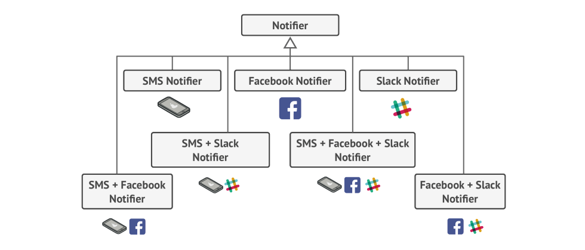
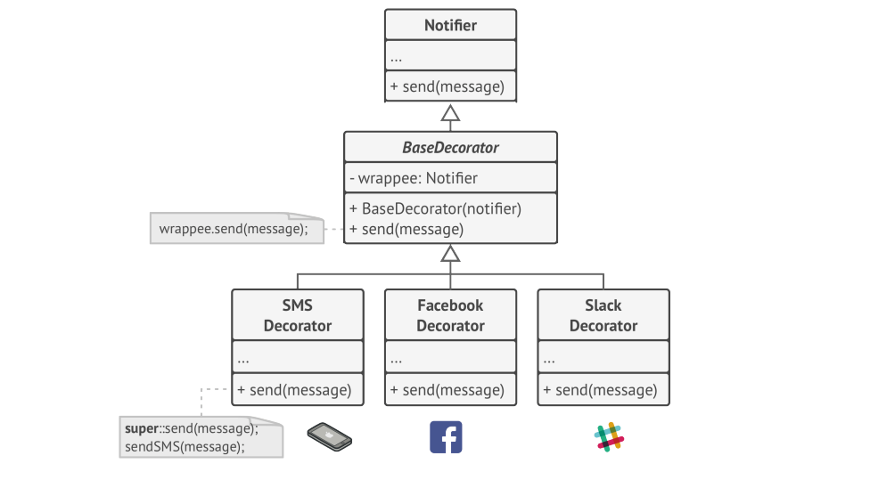

# Decorator Design Pattern

Decorator is a **structural** design pattern that lets you attach new behaviors to objects by placing
these objects inside special _wrapper_ objects that contain the behaviors.

## Problem

Imagine that you’re working on a notification library which lets other programs notify their 
users by sending a message to a list of emails that were passed to the notificator via its constructor. 

At some point, users of the library also would like to receive an SMS about critical issues. 
Others would like to be notified on Facebook, Slack, etc.

**How hard can that be?** You extend the Notifier class and put the additional notification 
methods into new subclasses. Now the client can instantiate the desired notification 
class and use it for all further notifications. But then someone reasonably asked you, 
**“Why can’t you use several notification types at once?"**

As you can see, this approach would bloat the code immensely, not only the library code
but the client code as well.

## Solution

Inheritance has several serious caveats that you need to be aware of:
1. Subclasses can have just one parent class. In most languages, inheritance doesn’t let a class
inherit behaviors of multiple classes at the same time.
2. Inheritance is static. You can’t alter the behavior of an existing object at runtime.
You can only replace the whole object with another one that’s created from a different subclass

One of the ways to overcome these caveats is by using **Composition** instead of Inheritance. 
With composition one object has a reference to another and delegates it some work, whereas with
inheritance, the object _itself_ is able to do that work, inheriting the behavior from its superclass.
With composition, you can easily substitute the linked object with another, 
changing the behavior of the container at runtime. 

Let’s leave the simple email notification behavior inside the base Notifier class, but turn all
other notification methods into decorators. The client code would need to wrap a basic notifier
object into a set of decorators that match the client’s preferences. The resulting objects
will be structured as a stack. The last decorator in the stack would be the object that the
client actually works with. Since all decorators implement the same interface as the base notifier, 
the rest of the client code won’t care whether it works with the “pure” notificator object
or the decorated one.

## Structure

1. The Component declares the common interface for both wrappers and wrapped objects.
2. Concrete Component is a class of objects being wrapped. It defines the basic behavior, 
which can be altered by decorators.
3. The Base Decorator class has a field for referencing a wrapped object. The field’s type should be
declared as the component interface, so it can contain both concrete components and decorators. 
The base decorator delegates all operations to the wrapped object.
4. Concrete Decorators define extra behaviors that can be added to components dynamically. 
Concrete decorators override methods of the base decorator and execute their behavior 
either before or after calling the parent method.
5. The Client can wrap components in multiple layers of decorators, as long as it works with all objects
via the component interface